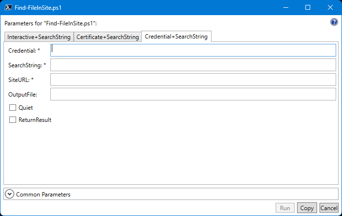

# SharePoint and OneDrive File Search PowerShell Script

Administrators may be asked to search SharePoint and OneDrive sites for various reasons. It may be for reporting or analysis. This script utilizes the [PnP.PowerShell](https://pnp.github.io/powershell/) module to find files by name, extension, or wildcard pattern in one or more sites.

- [Other alternatives exists?](#other-alternatives-exists)
- [Why use this script (and when)?](#why-use-this-script-and-when)
- [Requirements](#requirements)
  - [Environment](#environment)
  - [Authentication](#authentication)
    - [OPTION 1: Administrator Credential](#option-1-administrator-credential)
    - [OPTION 2: App-Only Credential with Certificate (Recommended)](#option-2-app-only-credential-with-certificate-recommended)
- [Syntax](#syntax)
  - [Using an Administrator Credential](#using-an-administrator-credential)
  - [Using App-Only Authentication](#using-app-only-authentication)
- [Parameters](#parameters)
- [Script Usage Examples](#script-usage-examples)
  - [Example 1: Find Files from a Site using Admin Credentials](#example-1-find-files-from-a-site-using-admin-credentials)
  - [Example 2: Find Files from a Site using App-Only Authentication with Certificate](#example-2-find-files-from-a-site-using-app-only-authentication-with-certificate)
  - [Example 3: Find Files from All SharePoint Sites Only and Write the Results to a Custom CSV File Path](#example-3-find-files-from-all-sharepoint-sites-only-and-write-the-results-to-a-custom-csv-file-path)
  - [Example 4: Find Files from All OneDrive Sites Only](#example-4-find-files-from-all-onedrive-sites-only)
- [Appendix](#appendix)
  - [Register an Azure AD App using the Register-PnPAzureADApp Cmdlet for App-Only Authentication](#register-an-azure-ad-app-using-the-register-pnpazureadapp-cmdlet-for-app-only-authentication)
    - [New App + New Self-Signed Certificate](#new-app--new-self-signed-certificate)
- [Q\&A](#qa)

## Other alternatives exists?

Yes, there are alternatives to use to search for files, such as compiance search in Exchange Online PowerShell using the [`New-ComplianceSearch`](https://learn.microsoft.com/en-us/powershell/module/exchange/new-compliancesearch?view=exchange-ps) cmdlet and in the [Microsoft Purview Content Search](https://learn.microsoft.com/en-us/training/modules/search-for-content-security-compliance-center/).

The [`Submit-PnPSearchQuery`](https://pnp.github.io/powershell/cmdlets/Submit-PnPSearchQuery.html) cmdlet is another alternative that searches the SharePoint Search Index.

## Why use this script (and when)?

While the native tools provide a convenient way to search files on all sites, they don't always show accurate and real-time results. For example, if the content or file is not indexed somehow, it will not show in the search index query results.

This script connects to each specified site, gets the existing files recursively, and filter the result based on your search string. But since the script reads ALL file properties in any given document library, the speed will depend on the volume of files.

> During testing, the script can retreive approximately 14,000 files in one document library recursively in around 10 minutes.

## Requirements

### Environment

- A Windows Computer
- [PowerShell 7.2](https://learn.microsoft.com/en-us/powershell/scripting/install/installing-powershell-on-windows)
- [PnP.PowerShell 2.3.0](https://www.powershellgallery.com/packages/PnP.PowerShell)

### Authentication

#### OPTION 1: Administrator Credential

- A non-MFA credential with a SharePoint Admin role and has full access to all SharePoint and OneDrive sites.

> **Note**: An alternative is to create a [*Trusted Location-Based Conditional Access Policy*] that bypasses the MFA requirement of the administrator account.

#### OPTION 2: App-Only Credential with Certificate (Recommended)

- Register an Azure AD App using the [Register-PnPAzureADApp](https://pnp.github.io/powershell/cmdlets/Register-PnPAzureADApp.html) cmdlet.

> Refer to Appendix: [Register an Azure AD App using the Register-PnPAzureADApp Cmdlet for App-Only Authentication](#register-an-azure-ad-app-using-the-register-pnpazureadapp-cmdlet-for-app-only-authentication)

## Syntax

### Using an Administrator Credential

```powershell
.\Find-FileInSite.ps1
    [-SiteURL] <String[]>
    -Credential <PSCredential>
    -SearchString <String[]>
    [-ReturnResult]
    [-OutputFile <String>]
    [-Quiet]
    [<CommonParameters>]
```



### Using App-Only Authentication

```powershell
.\Find-FileInSite.ps1
    [-SiteURL] <String[]>
    -ClientId <String>
    -Tenant <String>
    -Thumbprint <String>
    -SearchString <String[]>
    [-ReturnResult]
    [-OutputFile <String>]
    [-Quiet]
    [<CommonParameters>]
```


## Parameters

**`-SiteURL <String[]>`**

The site URL you want to search.

You can enter a single URL string:

```PowerShell
"https://contoso-my.sharepoint.com/personal/someone"
```

Or a collection:

```PowerShell
@(
    "https://contoso-my.sharepoint.com/personal/someone",
    "https://contoso.sharepoint.com/sites/sitename"
)
```

**`-Credential <PSCredential>`**

The PSCredential object of the account used to connect to the SharePoint or OneDrive site.

This credential must be:

- Non-MFA enabled SharePoint Administrator account
- Has Site Administrator or Owner access to all sites (or specific sites to search.)

**`-ClientId <String>`**

The client ID of application ID of the Azure AD app registration, if using app-only authentication instead of a credential.

**`-Tenant <String>`**

The SharePoint Online tenant ID, such as `contoso.sharepoint.com`, if using app-only authentication instead of a credential.

**`-Thumbprint <String>`**

The public key certificate thumbprint associated with the Azure AD app registration, if using app-only authentication instead of a credential.

The corresponding private certificate must be present in your personal certificate store `[cert:\CurrentUser\My\<thumbprint>]` for this to work.

**`-SearchString <String[]>`**

One of more specific file name or pattern to search. For example, `"*.pdf","filename.ext","file*.00*"`

**`-ReturnResult [<SwitchParameter>]`**

Indicates whether the search results will be returned.

**`-OutputFile <String>`**

The custom CSV file path to write the search results, if any. If not specified, the default output file path will be: `.\search\SPO_File_Search_yyyy-MM-dd_hh-mm-ss_tt_username.csv`

**`-Quiet [<SwitchParameter>]`**

Suppresses the informational output on the screen. The output will still be written to a log file with the same filename as the output filename with a `.LOG` extension.

**`<CommonParameters>`**

This cmdlet supports the common parameters: `Verbose`, `Debug`, `ErrorAction`, `ErrorVariable`, `WarningAction`, `WarningVariable`, `OutBuffer`, `PipelineVariable`, and `OutVariable`.

For more information, see [about_CommonParameters](https://go.microsoft.com/fwlink/?LinkID=113216).

## Script Usage Examples

### Example 1: Find Files from a Site using Admin Credentials

```PowerShell
$credential = Get-Credential

$results = .\Find-FileInSite.ps1 `
    -SiteURL "https://poshlab1.sharepoint.com/sites/ITOps" `
    -Credential $credential `
    -SearchString "app.yaml" `
    -ReturnResult
```


### Example 2: Find Files from a Site using App-Only Authentication with Certificate

In this example, the corresponding certificate is present in the personal certificate store with the thumbprint of `41C82D1E0EE6B423759387B0623FD632E2CD70C6`.


```PowerShell
$splat = @{
    SiteURL      = @(
        "https://poshlab1.sharepoint.com/sites/ITOps",
        "https://poshlab1-my.sharepoint.com/personal/june_poshlab_xyz"
    )
    SearchString = "*.docx", "*.pdf", "*.xml", "app.yaml"
    Tenant       = "poshlab1.onmicrosoft.com"
    ClientId     = "4b92dbfc-7b32-4824-8225-415df97a1ecf"
    Thumbprint   = "41C82D1E0EE6B423759387B0623FD632E2CD70C6"
    ReturnResult = $true
}

$results = .\Find-FileInSite.ps1 @splat
```


### Example 3: Find Files from All SharePoint Sites Only and Write the Results to a Custom CSV File Path

```PowerShell
# Must be connected to PnP PowerShell

# Get all SharePoint Sites
$urlCollection = (Get-PnPTenantSite).Url

$splat = @{
    SiteURL      = $urlCollection
    SearchString = "*.docx", "*.pdf", "*.xml", "app.yaml", "*.pptx"
    Tenant       = "poshlab1.onmicrosoft.com"
    ClientId     = "4b92dbfc-7b32-4824-8225-415df97a1ecf"
    Thumbprint   = "41C82D1E0EE6B423759387B0623FD632E2CD70C6"
    OutputFile   = "C:\temp\spo_search_results.csv"
}

.\Find-FileInSite.ps1 @splat
```


Resulting Custom CSV File


### Example 4: Find Files from All OneDrive Sites Only

```PowerShell

# Must be connected to PnP PowerShell

# Get all OneDrive Sites
$urlCollection = (Get-PnPTenantSite -IncludeOneDriveSites -Filter "Url -like '-my.sharepoint.com/personal/'").Url

$splat = @{
    SiteURL      = $urlCollection
    SearchString = "*.docx", "*.pdf", "*.xml", "app.yaml", "*.pptx"
    Tenant       = "poshlab1.onmicrosoft.com"
    ClientId     = "4b92dbfc-7b32-4824-8225-415df97a1ecf"
    Thumbprint   = "41C82D1E0EE6B423759387B0623FD632E2CD70C6"
    ReturnResult = $true
}

$results = .\Find-FileInSite.ps1 @splat
```

## Appendix

### Register an Azure AD App using the Register-PnPAzureADApp Cmdlet for App-Only Authentication

> NOTE: This action requires you to log in using an account with write access to Azure AD.

#### New App + New Self-Signed Certificate

Run the following commands in PowerShell. Make sure to replace the appropriate values as needed.

```powershell
# Import the module
Import-Module PnP.PowerShell

# Compose the Application properties
$splat = @{
    ApplicationName     = 'SharePoint File Search App'
    CertificatePassword = ('Reawake2#Conform#Throttle' | ConvertTo-SecureString -AsPlainText -Force)
    OutPath             = (Get-Location).Path
    Tenant              = 'poshlab1.onmicrosoft.com'
    Store               = 'CurrentUser'
    Interactive         = $true
}

# Register the application
Register-PnPAzureADApp @splat -OutVariable appReg
```


Log in with your administrator credentials when prompted.


Accept the permissions request.

> **Note that only a Global Administrator can accept or grant consent on behalf of the organization. If not, a Global Administrator can grant the consent from the Applications Registration page in Azure AD (Entra ID)**


Once registered, you'll receive the following information.


Finally, test if you can login to PnP PowerShell using the new Azure AD app.

```powershell
Connect-PnPOnline `
    -ClientId $appreg[0].'AzureAppId/ClientId' `
    -Tenant 'poshlab1.onmicrosoft.com' `
    -Thumbprint $appreg[0].'Certificate Thumbprint' `
    -Url "https://poshlab1-admin.sharepoint.com"

Get-PnPTenantInstance
```


## Q&A

**Question: Can I export the results to a CSV file?**
> *Yes. Ensure to use the `-ReturnResults` switch and pipe to the `Export-Csv` cmdlet.*
>
> *The script automatically creates a CSV file containing the search results. The default location is under the `.\search\` subfolder.*
>
>*You can also specify a custom CSV file to use with the `-OutputFile <filepath>` parameter.*

**Question: If I do not use the `-ReturnResult` switch, how can I see the search results?**
> *The script automatically creates a CSV file containing the search results. The default location is under the `.\search\` subfolder.*
>
> *You can also specify a custom CSV file to use with the `-OutputFile <filepath>` parameter.*

**Question: Does the script also search the default SharePoint Tenant URLs?**
> *No, it doesn't. The script deliberately ignores the tenant URLs such as the following.*
>
> ```text
> MySiteHostUrl  : https://*-my.sharepoint.com/
> PortalUrl      : https://*.sharepoint.com/
> RootSiteUrl    : https://*.sharepoint.com/
> TenantAdminUrl : https://*-admin.sharepoint.com/
> ```
>
> It also ignores the URLs matching these patterns:
>
> `".*-my\.sharepoint\.com/$|.*\.sharepoint\.com/$|.*\.sharepoint\.com/search$|.*\.sharepoint\.com/portals/hub$|.*\.sharepoint\.com/sites/appcatalog$"`

**Question: Does the script also search the default system libraries?**
> *No, it doesn't search the default system libraries such as the following:
> `'Form Templates', 'Pages', 'Preservation Hold Library', 'Site Assets', 'Site Pages', 'Images',
        'Site Collection Documents', 'Site Collection Images', 'Style Library'`*

**Question: What happens if the administrator account doesn't have site administrator or owner access to the site?**
> *The search operation will fail with an `unauthorized` error. This is why it is recommended to use App-Only authentication instead of an administrator credential.*
>
> *Refer to Appendix: [Register an Azure AD App using the Register-PnPAzureADApp Cmdlet for App-Only Authentication](#register-an-azure-ad-app-using-the-register-pnpazureadapp-cmdlet-for-app-only-authentication)*

**Question: I want to use app-only authentication but I don't have the Global Administrator role to grant application permissions required?**
> Register the Azure AD application (if you have the right role) and ask your Global Administrator to grant the consent separately.
